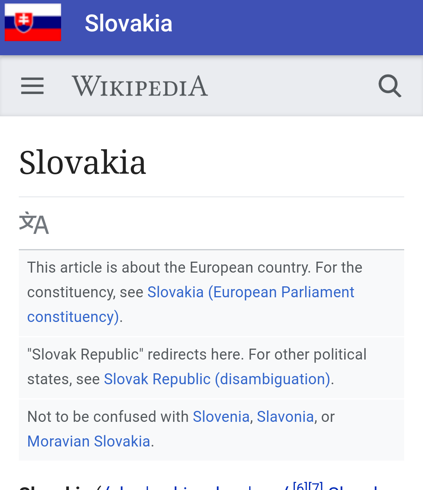

# Custom Adapters

Now these are adapters created to bind to UI elements not originally supported by Databinding
 `service/PicassoImageAdapter, service/WebViewAdapter, service/toolbarAdapter`.
 These adapters are used @`activity_wiki.xml`

 The goal is to make sure the adapters are working by going to `Build/Make Project`.
 One can identify if there are issues with the adapter at the console.
 In my case I had at times binding adapters which didn't match the argument type passed into the view.

 That was my case when passing a string id to the WebView adapter. I had to make sure to include an adapter supporting an integer.

 ```
@BindingAdapter("loadUrl")
    public static void loadUrl(WebView view, int urlId) {
        if( urlId != 0 ){
            loadUrl( view,view.getResources().getString( urlId ) );
        }
    }
```

So this is how my webview looks
```xml
<WebView app:loadUrl="@{countrySource.url}"...></WebView>
```

This is what it looks like:

[]