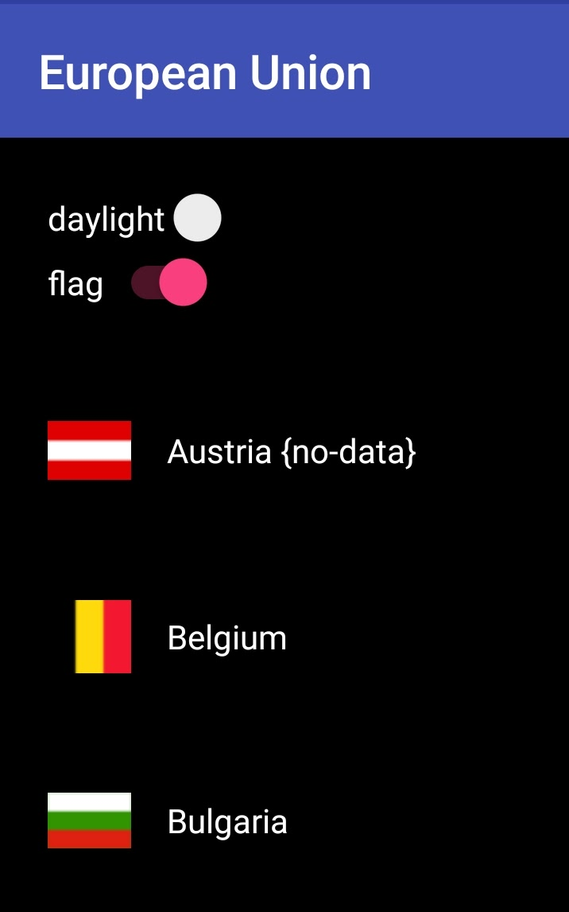

# ModelViewViewModel (MVVM)

This time we are making two viewModels. One is for the app styling, and another one is for countries.

`AppViewModel` provides two properties.
*   dayMode: shows the activity in day or night mode.
*   show-flags: display flags in the RecyclerViewList, or the WikiActivity

`CountryViewModel`
*   Has a list of countries.
*   Instead of providing the selected country from an intent extra to the second activity. We are referencing it through `countrySelected`


 Here are a few things I learned while doing this demo.

 *  We cannot update the theme dynamically. It happens before building an activity; therefore, we can finish and restart the activity.
 *  We also cannot update styles at runtime. So now there is a `service/ThemeAdapter` which provides adapters to change background and text color at runtime.

Things I discoverd in MVVM.
* You can make your fields observables such as `ObservableInt`, or `ObservableString`
    * Getter/Setter approach `field.get()`, `field.set(value)`
    * The current ViewModel is aware of changes and updates itself so the binding is reflected anywhere else.
* For unsupported types you can make your own by extending your class to `BaseObservable` like it happens with our two ViewModels.
    * You don't have to do this if your field is within your ViewModel. All you do is in your getter provide on top `@Bindable`

* Any of these two ways generates binding resources which are referenced through `BR` just like we have `R` in Android.
    * You can then listen for changes in the ViewModel by registering updates made at `BR.field`. This is my case in `services/CountryAdapter`
    ```java
    //updates in countries require to refresh the recycler view.
    getCountryViewModel().addOnPropertyChangedCallback(new OnPropertyChangedCallback() {
                   @Override
                   public void onPropertyChanged(Observable observable, int brId) {
                       if(BR.countries == brId){
                           notifyDataSetChanged();
                       }
                   }
               });
   ```
* Double binding works, and I might need to do further research as it is happeing in `activity_main.xml`. There I am using the switches to display the boolean values, but also those same values can be updated by their switches. `@={appViewModel.dayMode}`
* I had to update this branch as I discovered more of how binding works. My ViewModels turned into two observable objects which have brains and can do more login under the hood. I worked before in AngularJS, and KnockoutJS so for me this was a rewind of old work. It is exciting to see MVVM being done in Android.


So here our daylight switch is on, and so is our show-flags switch.

